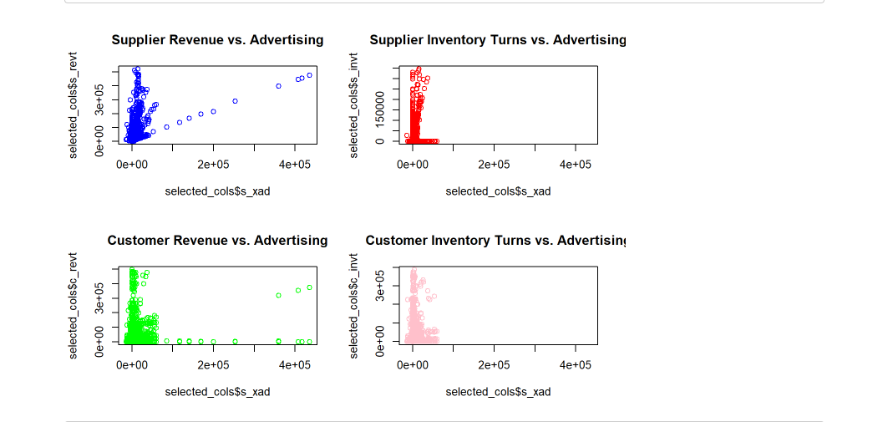

# Effect of Supplier Advertising and R&D Expenses on Customers, New Product Introductions, and Supplier Revenue

In this project, we aim to investigate the impact of supplier advertising and R&D expenses on customer behavior,
new product introductions, and supplier revenue using R programming language.

## Demonstration

## Process

To achieve this, we will analyze data on supplier and customer financials,
inventory turns, and new product introductions.

Specifically, we will explore how changes in supplier advertising and R&D expenses affect customer behavior,
as measured by new product introductions and price cuts, and how these changes impact supplier revenue.

The insights gained from this analysis can help businesses make informed decisions
about their advertising and R&D investments to achieve their desired outcomes.

### Conclusion

By understanding the relationship between these variables,
we can provide valuable insights to help optimize investments in advertising and R&D,
and improve the overall performance of the supply chain.
